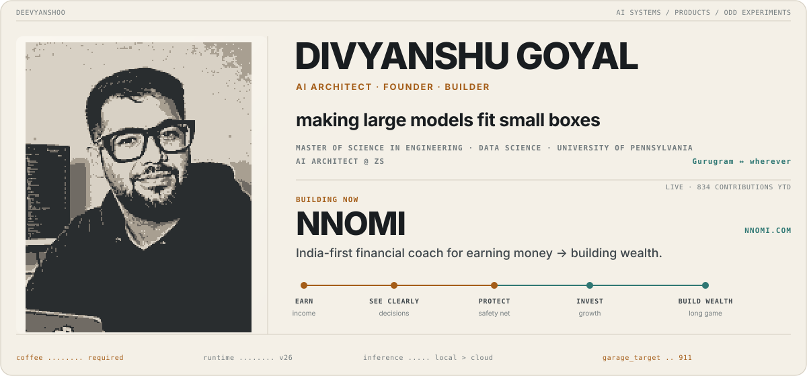
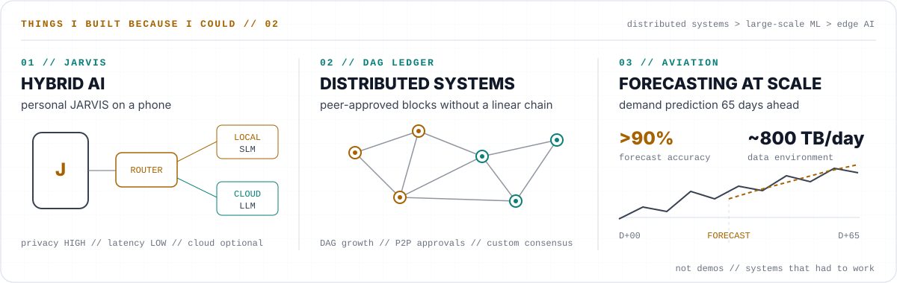

<picture>
  <source media="(prefers-color-scheme: dark)" srcset="assets/profile-dark.svg">
  <source media="(prefers-color-scheme: light)" srcset="assets/profile-light.svg">
  
</picture>

## Building

### [Nnomi](https://nnomi.com)

**An India-first financial coach for the journey from earning money to building wealth.**

Money advice often starts after the hard part. Nnomi starts at the paycheck: see where it goes, make better everyday decisions, build a safety net, then invest with context.

[Meet Nnomi →](https://nnomi.com)

### [Chauffit](https://chauffit.com)

**AI-powered, safety-first on-demand driver marketplace.**

A serious attempt at making it easier to get home safely when you need a driver, not another ride.

[Visit Chauffit →](https://chauffit.com)

## Things I built because I could

### [CoderPolice](https://github.com/deevyanshoo/coderpolice)

**Okay, but prove it.**

Open-source conformance tests for the engineering around coding agents: evidence, review, authority, stale state, and all the stuff agents confidently claim they handled.

[Break it →](https://github.com/deevyanshoo/coderpolice/issues/11)

<picture>
  <source media="(prefers-color-scheme: dark)" srcset="assets/systems-dark.svg">
  <source media="(prefers-color-scheme: light)" srcset="assets/systems-light.svg">
  
</picture>

<strong>build weird things. make them useful. ship them.</strong>

## Current obsessions

Smaller models, better routers, agents with fewer excuses, and AI that knows when not to call the cloud.

Working set: Python, TypeScript, C++, FastAPI, Next.js, PostgreSQL, Docker, Kubernetes, and AWS.

## Outside the terminal

F1, football, watches, music, coffee, and taking hardware apart with unjustified confidence. German cars remain a recurring threat to the investment plan.

## Find me

[LinkedIn](https://www.linkedin.com/in/divyanshoo) · [Nnomi](https://nnomi.com) · [Chauffit](https://chauffit.com)

Telemetry & privacy

The hero may show one live signal: year-to-date GitHub contributions, and only when the count is at least 100.

Private activity can affect GitHub's anonymous restricted-contribution aggregate. The collector never requests private repository names, descriptions, topics, organizations, commits, branches, issues, filenames, or URLs, and none of that metadata can enter the renderer or committed SVGs.

